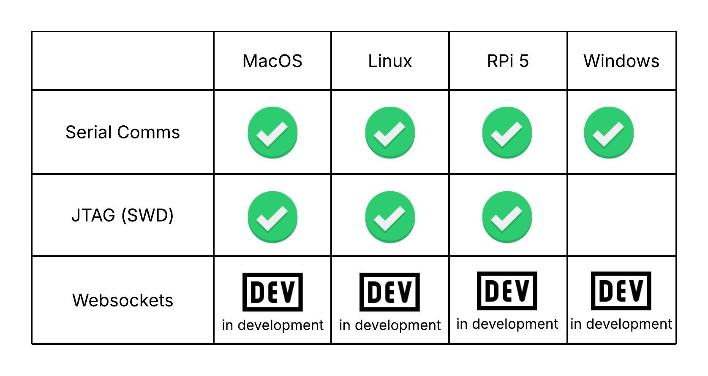
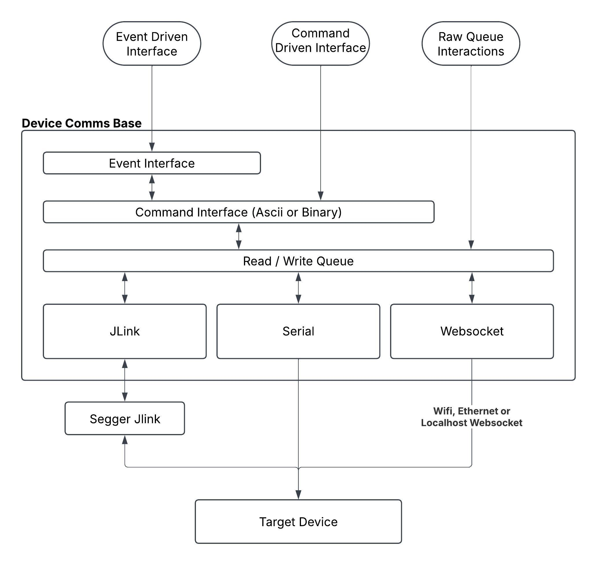

# DeviceComms

The DeviceComms library allows you to open up a comms channel with hardware devices to the end goal of being able to easily use the data streams coming they produce.

Ultimately, both ascii and binary interfaces will be supported across all transports, but at this time, only ascii interfaces are supported. stay tuned.



### Design Goals

The top design goals are as follows:

1. Quickly go from cloning this repo -> talking to your target hardware
2. Enable communications over Serial, Jlink and websockets
3. Handle all of the OS-level interactions and thread/process synchronization required to communicate with embedded devices.
4. Provide interfaces that enable meaningful interactions out of the box. the target interactions are:
   - automating development processes
   - automated test interactions
   - manufacturing test scripts
   - easily connect your own GUI to Device Comms objects for graphing or other custom GUIs

### Major Interfaces
I will introduce the major interfaces here but they are best understood through examples below.

The major programmatic interfaces are:
A. message based command / response
B. custom event based command / response
C. message queue interactions to safely grab unprocessed data

The layering of these interfaces are arranged as in the following diagram:



In order to dive into examples lets get setup first.

### Setup
pip install requirements.txt

that's it. now just connect a device over serial, jtag (jlink swd only for now), ... (coming soon) websocket (connect it to your local network).

## quick start

We will do these examples with a serial device, but after the instantiation, all functions extend a common base class and therefore share the same core functionality.

```Python
# Create a Device Comms config object. For now, just be aware each transport layer has its own config struct.

# each file in this repo includes a logger you can configure. i'll place one here so we see lots of data.

logging.basicConfig(
    level=logging.DEBUG,
    format="%(asctime)s - %(name)s - %(levelname)s - %(message)s"
)

from serial_device import *

config = SerialCommsDeviceConfig( serial_device_path = "/dev/tty.usbmodem123",
                                  baud_rate = 115200)

device = SerialCommsDevice( config )

device.start_capturing_traces()

# now you should have an active interface you can get traces (i.e. device logs) and send commands to.

```

## Interface 1: The message Interface Parameters

Interacting with the message interface is pretty simple. Most fundamentally, you can send messages and wait for reponses:

```Python
device.send_cmd("echo hello world")

device.wait_for_trace("hello world")

# or combine it together

device.wait_for_trace(cmd = "echo hello world",
                      required_traces = "hello world")
```

in all '...wait\_for\_trace()' functions you get a lot of configurability. This configurability on waiting for responses in the way you need really makes the library.

* <strong>resp_req</strong> (optional. default None) - required responses. string or list of strings. all of the provided strings must be seen in stdout in order to be considered successful. run until all required responses are found.
* <strong>resp_avoid</strong> (optional. deafult=None) - avoided responses. string or list of strings. if any of these responses are seen, fail and return immediately.
* <strong>timeout_ms</strong> (optional. deafult=10000)-  max process runtime. 0 == no timeout. if the process does not complete by the given time, fail and return.
* <strong>run_to_completion</strong> (optional. default=False) - run till process completion? Useful if you do not care about the output but you do want the process to run. e.g. "kill 12345"
* <strong>accumulate_traces</strong> (optional. default=False) - should we return everything printed to stdout? by default we only return the last stdout trace we received.
* <strong>cmd_recovery_time_ms</strong> (optional. default=0) - after we complete the desired cmd processing, how long should we wait before tearing down processes and subprocesses. this can be helpful with some larger complexity software services or using hardware programmers that may require some recovery before disconnect for stability purposes.
* <strong>return_on_first_match</strong> (optional. default=False) - return on any found resp\_req instead of waiting for all of resp\_req.
* <strong>use_backlog</strong> (optional. default=True) - Traces are always accumulating. should we use the traces we've already accumulated when looking for traces? false will cause the trace queue to be cleared first

<strong>Note:</strong> There are 2 main ways to set the end of the cmd processing, by setting a response(s) that is required or by setting the 'run\_to\_completion' flag to true. Without one of these set, the cmd will likely be issued and return before any data has been processed.

## Return

* was\_successful
  when the start() returns it returns 'wasSuccessful == true' if:
     1) the required parameters, if any, were found.
     2) no avoided responses, if any, were found
     3) we did not timeout before completing processing as directed
* traces - stdout from the cmd or a list of dictionaries containing traces and meta data (more on this below)
* responses\_remaining - upon returning, what required responses have not yet been found? helpful for troubleshooting failures as well as scenarios where you want to react to a series of async messages but only once. (see design patterns below)

## Interface 2: Event Interface

Often times you will end up using the same strings over and over again. To make this more maintainable, we'll use the concepts of Events. An Event may be one of a few strings where the string definitions are centrally managed wherever you decide. The only major change from the message / ascii interface is this abstraction layer. they both use the same parameters in the same way. Use of the event interface is more appropriate for larger projects like an automated test suite, though you can freely interchange between event and message interfaces at will.

```Python
from enum import Enum, auto

# at some central location, create a definition of events
class Events(Enum):
    BUTTON_PRESS = auto()
    BUTTON_RELEASE = auto()
    BOGUS_EVENT = auto()

# also create a corresponding map of <event> : <regex string>
# this will allow us to use the Events definitions instead of dealing in raw strings.
# the only raw strings exist right here and can be centrally managed
global_event_map = {
                       Events.BUTTON_PRESS : r"Button (?P<button_num>\d+) pressed",
                       Events.BUTTON_RELEASE : r"Button (?P<button_num>\d+) released",
                       # for illustration only:
                       Events.BOGUS_EVENT : r"SomeTraceThatWillNeverBeProduced",
                    }

# tell whatever device you instantiated about your event mapping
device.set_event_map( global_event_map )

###############################################################################
# now that we have this setup, we can deal in events instead of strings
###############################################################################

# if we are waiting for some button press event, we can do this:

success, events, remaining_search = device.wait_for_event( required_events = Events.BUTTON_PRESS )

```

Dealing in Events where possible is highly encouraged. in order to keep the examples as simple as possible we will show most examples in the more basic string string processing, but you should be able to replace wait\_for\_trace and wait\_for\_event

# Parameter Examples

showing how these parameters is used is best done through examples.

In all of these examples, assume that you have a CLI command 'echo' that will print out the argument you gave it.

so running

| > echo foo

will return

| foo

Also assume that we have created a device object already. To improve readability we will not repeate this code. The init code will look like one of the following:

## Serial Device:

```Python
serial_config = serial_device.SerialCommsDeviceConfig(
                            serial_device_path = "/dev/tty.usbmodem31201",
                            baud_rate = 115200)

serial_device = serial_device.SerialCommsDevice(serial_config)
```

## JLink Device:

```Python
jlink_config = jlink_device.JLinkTransportConfig( "STM32G491VE", speed=4000 )

jlink_device = jlink_device.JLinkDevice(jlink_config)
```

## Websocket Device:

coming soon

### Base Example: Simple serial comms using raw trace strings

```Python
success, traces, _ = device.wait_for_trace( cmd = "echo VERSION:1.2.3",
                             required_responses = r"VERSION:\s*v\d+\.\d+\.\d+",
                             timeout_ms = 4000)

assert(success)

print(f"found desired traces: {traces}")

# expected to see 'found desired traces: VERSION:1.2.3'

the default trace_response_format for wait_for_trace is TraceResponseFormat.RAW_TRACES. waiting for a trace yields a trace back.

```

### Trace Response Format: Simple serial comms using raw trace strings, with processed results

if we give named regex fields and request the results be processed then we get back a more useable structure. specifically, any named regex groups will have their name : value pair added to the resulting trace object as shown below

```Python
success, traces, _ = serial_device.wait_for_trace( cmd = "echo VERSION:1.2.3",
                             required_responses = r"VERSION:\s*v(?P<version_major>\d+)\.(?P<version_minor>\d+)\.(?P<version_patch>\d+)",
                             trace_response_format = TraceResponseFormat.PROCESSED_RESPONSES
                             )

assert(success)

print(f"found desired traces: {traces}")

# now the traces results will look like:
# traces : [ {
#               _trace: "VERSION:1.2.3",
#               _regex_search_string : r"VERSION:\s*v(?P<version_major>\d+)\.(?P<version_minor>\d+)\.(?P<version_patch>\d+)",
#               version_major: "1",
#               version_minor: "2",
#               version_patch: "3",
#            },
#          ]
#

```

### Device Trace Collection Pattern: when parsing raw traces, control which trace we return

in the event we have many traces we are looking for, we may want everything that came through the CLI (ALL), we may want just the last matching trace (LAST\_ONLY) or we may want all of the traces in our set of responses (MATCHING). lets say we are looking for 3 traces:

```Python

expected_strings = [r"foo\d", r"bar\d", r"baz\d"]

# lets create a command that will generate 3 lines from the CLI with the echo command
cmd = "echo foo1\nbar2\nbaz3"

# Now lets use the 3 possible values.

########################
# return all matches
########################
success, traces, _ = device.wait_for_trace( cmd = cmd,
                             required_responses = expected_strings,
                             trace_collection_pattern = DeviceTraceCollectPattern.MATCHING,
                             )

assert(success)

# traces = ['foo1', 'bar2', 'baz3']

########################
# return all traces while we searched
########################
success, traces, _ = device.wait_for_trace( cmd = cmd,
                             required_responses = expected_strings,
                             trace_collection_pattern = DeviceTraceCollectPattern.ALL,
                             )

assert(success)

# traces = ['foo1', 'bar2', 'some other system trace', 'baz3']

########################
# return last trace
########################
success, traces, _ = device.wait_for_trace( cmd = cmd,
                             required_responses = expected_strings,
                             trace_collection_pattern = DeviceTraceCollectPattern.ALL,
                             )

assert(success)

# baz3 is the last matching trace
# traces = ['baz3']

```

### Use backlog example: when using raw traces, control which trace we look through

it can be very nice to not have to worry about traces that are sent when we are not monitoring the system. if you are waiting for a series of traces in a while loop, for instance, this is great. if you are just starting out a test, for example, you may not want traces hanging around from a previous test. in that instance you would want to clear the backlog first.

to demonstrate this we will create items in the trace backlog in the first call to wait for trace then do something interesting in the second call.


```Python

expected_strings = [r"foo\d", r"bar\d", r"baz\d"]

# lets create a command that will generate 3 lines from the CLI with the echo command
cmd = "echo foo1\nbar2\nbaz3"

# Now lets use the 3 possible values.

########################
# generate some logs in the queue
########################
# generate 3 traces but return immediately on the first match
success, traces, _ = device.wait_for_trace( cmd = cmd,
                             required_responses = r"foo",
                             return_on_first_match = True,
                             )

# traces = ['foo1']
# still in the backlog are traces 'bar2' and 'baz3'

# if we use the backlog to find bar2

########################
# if we use the backlog of traces then we will still operate on those other queued traces
########################
success, traces, _ = device.wait_for_trace( cmd = cmd,
                             required_responses = r"bar\d",
                             trace_collection_pattern = DeviceTraceCollectPattern.ALL,
                             )

assert(success)

# traces = ['bar2'] #<-- this is the bar2 from the first command, not the 2nd
# still in the backlog are ['baz3','foo1','bar2','baz3']


########################
# lets clear the backlog
########################
success, traces, _ = device.wait_for_trace( cmd = cmd,
                             required_responses = baz3,
                             use_backlog = False,
                             )

assert(success)

# use_backlog was set to False, the trace backlog was purged before the cmd was
# issued

# traces = ['baz3'] #<-- this is the newly generated baz3 response. since trace backlog is empty.

```

### Trace Events

Note: all of the above parameters are the exact same for the wait\_for\_event function. So every parameter example from above can be directly applied to the wait\_for\_event function. the only thing that is different is that when the trace\_response\_format is set to TraceResponseFormat.PROCESSED\_RESPONSES, you'll also get meta data about the corresponding event.

# SUPPORT

For bugs: Report reproduction steps and OS to bugs@rmlconsulting.dev - if you
know how to fix it, please just push a PR

For questions and customization requests: questions@rmlconsulting.dev
